# ResQu AI – Emergency Response & Disaster Assistance Platform

ResQu AI is an advanced, AI-powered emergency response assistant and real-time situational awareness dashboard designed for citizens, volunteers, medical networks, and Emergency Operations Command (EOC) centers. It is built under the **"Agents for Good"** track to assist during critical regional disasters, localized for **Mumbai, India**.

---

## 📸 Application Showcase

### 1. Emergency Operations Command (EOC) Dashboard
The EOC Dashboard provides a unified command center displaying live crisis stats, active incidents stream, and resource availability (shelter and hospital beds) on an interactive dark-themed map centered over Mumbai.
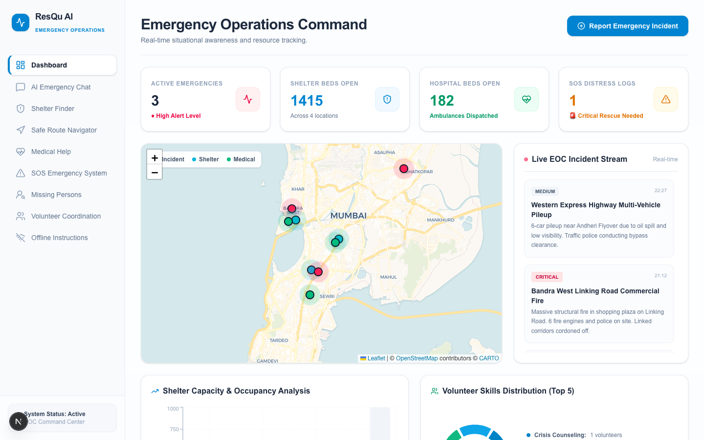

### 2. AI Emergency Coordinator (Multi-Agent Chatbot)
State your emergency or request assistance. The Coordinator dynamically delegates queries (e.g., first-aid steps or route safety checks) to specialized agents, rendering live agent routing traces.
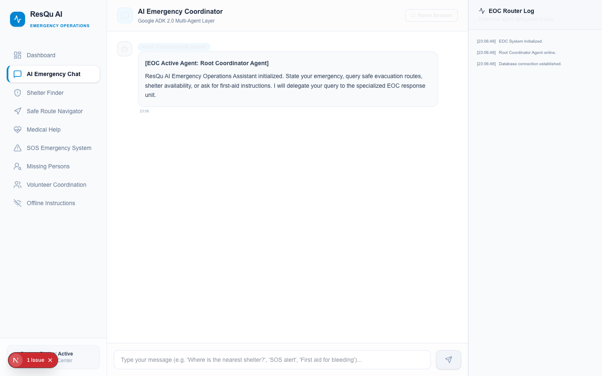

### 3. Shelter Finder
List and search active emergency shelter locations, filtering by pet friendliness, medical support, and capacity. Pan-zoom links directly focus the map on the selected shelter.
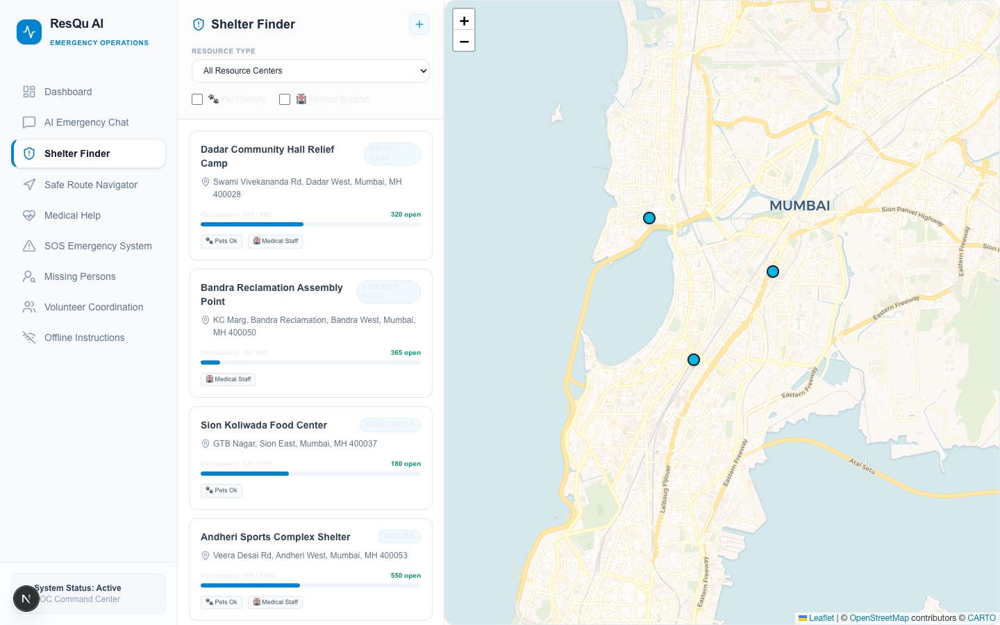

### 4. Evacuation Route Planner
Define origin and destination coordinates on the map. The Routing Agent will calculate the safest route, dynamically charting a path that avoids active critical incident zones.
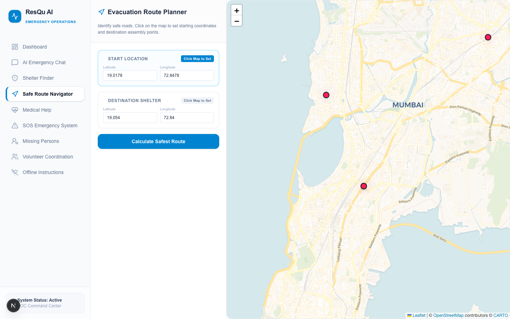

### 5. Emergency Medical Help Directory
A live directory of nearby hospitals (KEM, Lilavati, Sion) showing available beds, blood bank inventories, and quick dispatch ambulance numbers.
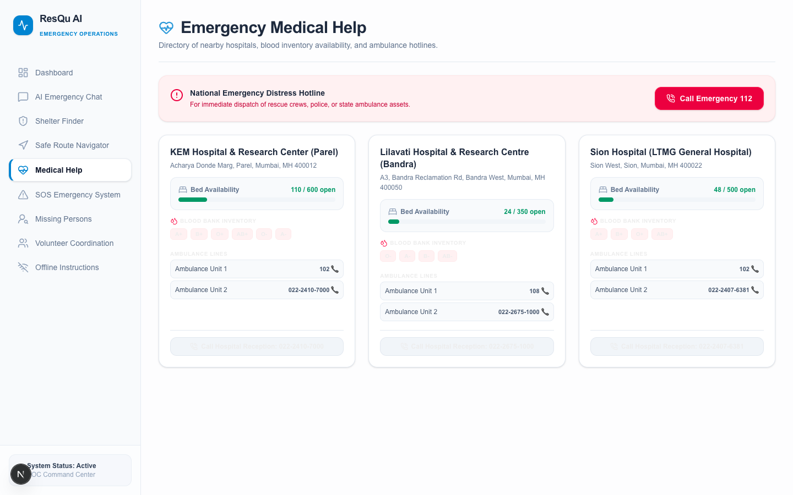

### 6. SOS Distress System
Initiate a high-priority distress broadcast with mock GPS capture, notifying EOC responders immediately.
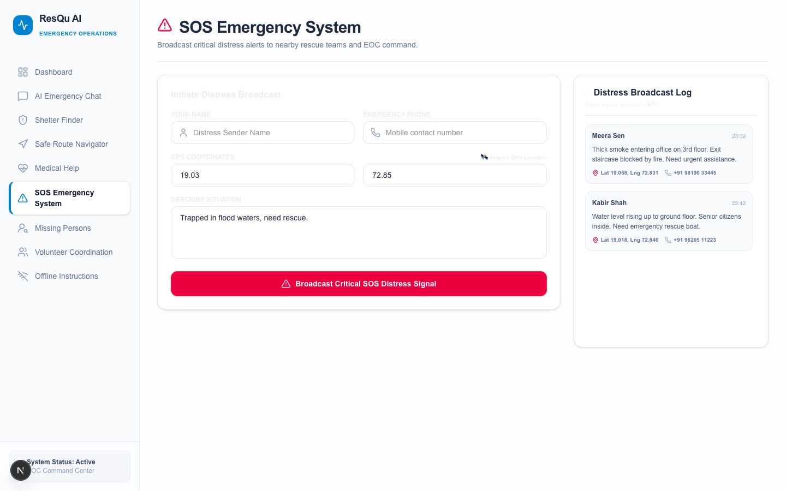

### 7. Missing Persons Board
Search, register, and track missing person profiles to help reunite separated family members during crises.
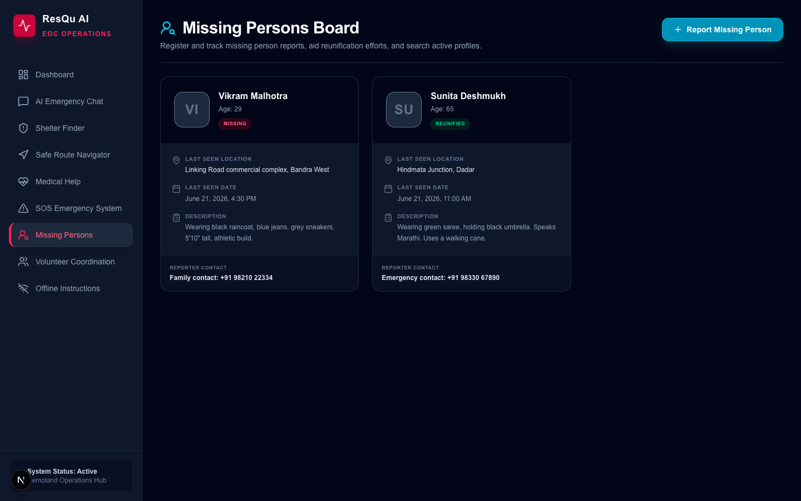

### 8. Volunteer Center
Coordinate crisis responders by registry and match their specialized skills (CPR, translation) with active EOC emergency tasks.
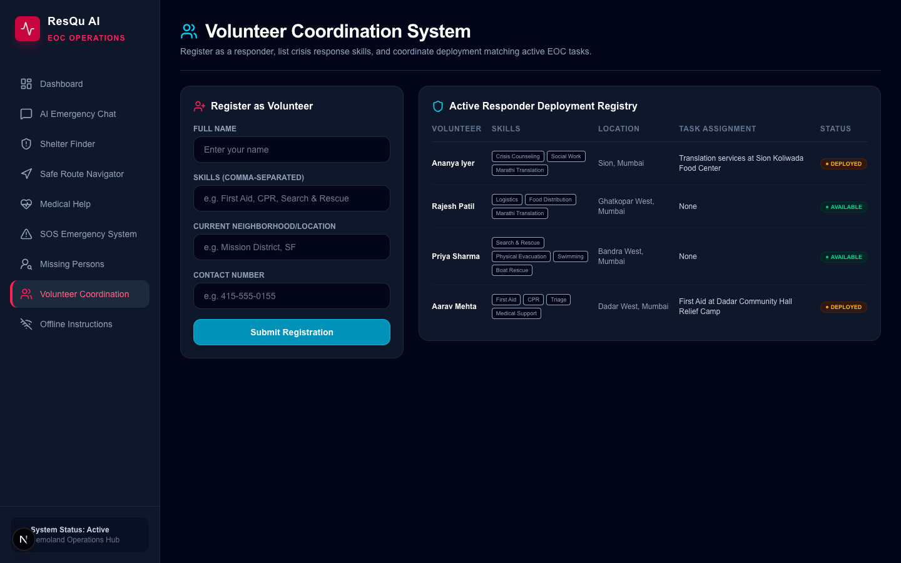

### 9. Offline Emergency Mode
Access survival checklists, CPR guides, and earthquake/fire protocol manuals locally without active internet. Complete with direct browser print-to-PDF layout options.
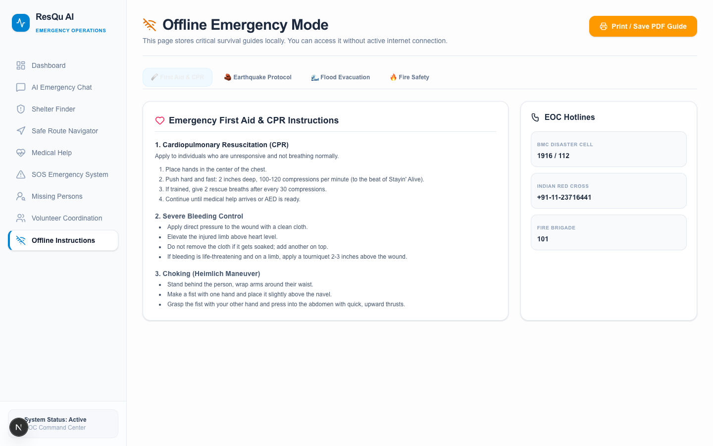

---

## 🚀 Key Features

1. **AI Emergency Assistant**: A chat assistant utilizing a multi-agent routing structure (Google ADK 2.0) that classifies emergencies and delegates tasks to specialized sub-agents.
2. **EOC Dashboard**: Real-time situational command center with live counts of active emergencies, open shelter beds, open hospital beds, pending SOS alarms, and live stream logs.
3. **Interactive Maps (Leaflet)**: Pulse-marked coordinate mapping tracking active flood zones, fires, landslides, shelters, and hospitals.
4. **Evacuation Route Planner**: Generates safe routes between origin and destination coordinates, dynamically re-routing to bypass active hazard polygons.
5. **Medical Help Directory**: Displays nearby hospitals (KEM, Lilavati, Sion) with live bed counts, blood bank inventory, and quick-dial ambulance links.
6. **SOS Distress System**: Immediate broadcast of critical SOS tickets with mock GPS tracking to BMC/EOC dispatch teams.
7. **Missing Persons Board**: Searchable log of reported missing individuals with status tracking (missing, found, reunified).
8. **Volunteer Center**: Crisis responder deployment matching skills (CPR, Search & Rescue) with active EOC emergency tasks.
9. **Offline Emergency Mode**: Local-first survival guides (CPR, Earthquake protocols, Flood/Fire guidelines) printable to PDF for physical use.

---

## ⚙️ System Architecture

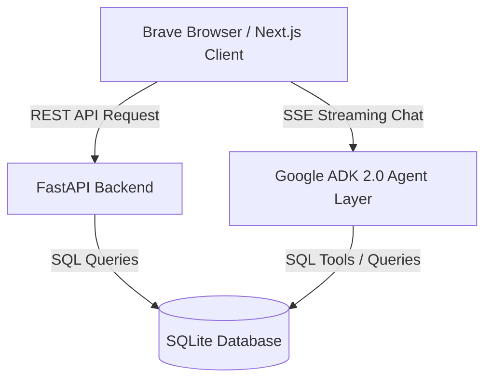

### Specialized Agents Layer
- **Root Coordinator Agent**: Orchestrates query analysis and delegates conversation contexts.
- **Resource Agent**: Queries database to locate open shelters, food centers, and distribution networks.
- **Routing Agent**: Evaluates road safety, blocked ways, and coordinates safe paths.
- **Medical Agent**: Accesses hospital bed capacity, blood banks, and guides basic first aid / CPR.
- **Communication Agent**: Dispatches SOS distress alerts to responder dispatch pipelines.
- **Preparedness Agent**: Generates tailored preparedness plans and supply checklists.

---

## 🔄 User Workflows

### 1. Emergency Assistance & Delegation Flow
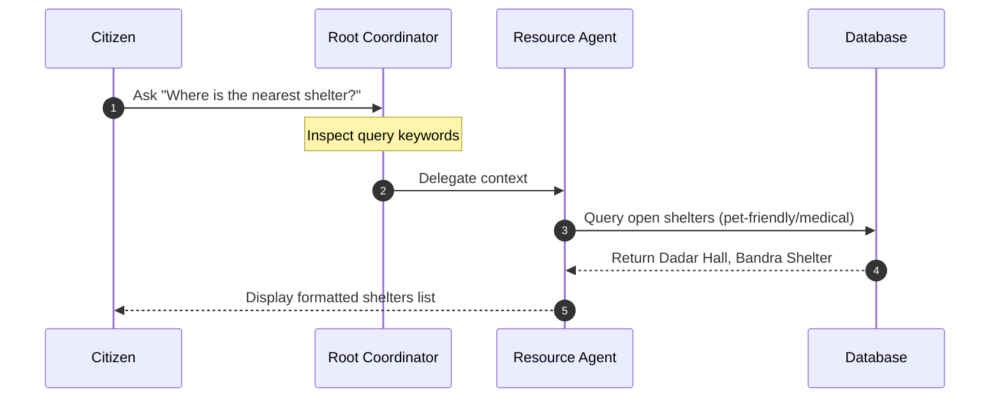

### 2. SOS Alert Broadcast Flow
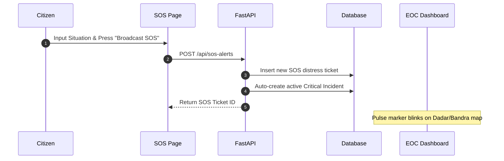

---

## 🛠️ Local Installation & Setup

### Option 1: Running with Docker Compose (Recommended)
This is the easiest way to launch the entire full-stack application (frontend + backend + persistent SQLite database) in one command:

1. Ensure you have **Docker** and **Docker Compose** installed.
2. In the project root, run:
   ```bash
   docker compose up --build
   ```
3. Open [http://localhost:3000](http://localhost:3000) in **Brave Browser** to access the application.

---

### Option 2: Running Manually

#### Prerequisites
- Node.js (v18+)
- Python (v3.10+)
- [uv](https://github.com/astral-sh/uv) (recommended) or pip

#### Backend Setup (FastAPI)
1. Navigate to the backend directory:
   ```bash
   cd backend
   ```
2. Initialize virtual environment and install dependencies:
   ```bash
   uv venv
   source .venv/bin/activate
   uv pip install -r pyproject.toml
   ```
3. Initialize and seed the database with Indian/Mumbai data:
   ```bash
   uv run python -m app.seed
   ```
4. Start the FastAPI development server:
   ```bash
   uv run python -m uvicorn app.fast_api_app:app --port 8000 --log-level info
   ```

#### Frontend Setup (Next.js)
1. Navigate to the frontend directory:
   ```bash
   cd ../frontend
   ```
2. Install dependencies:
   ```bash
   npm install
   ```
3. Run the Next.js development server:
   ```bash
   npm run dev -- -p 3000
   ```
4. Open [http://localhost:3000](http://localhost:3000) in **Brave Browser**.

---

## 🌐 Production Cloud Deployment Guide

A fully working production deployment requires hosting the FastAPI backend on a server platform and hosting the Next.js frontend on a static/serverless platform.

### Step 1: Deploying the FastAPI Backend
You can host the Python FastAPI backend on services like **Render**, **Railway**, **Fly.io**, or **Google Cloud Run**.

#### Using Render (Quickest)
1. Sign up for a [Render](https://render.com) account.
2. Click **New +** and select **Web Service**.
3. Connect your GitHub repository containing the `ResQu-AI` project.
4. Set the following fields:
   - **Root Directory**: `backend`
   - **Runtime**: `Docker` (Render will automatically detect `backend/Dockerfile`)
   - **Instance Type**: Free or Starter
5. Add the following **Environment Variables** in Render's configuration:
   - `GOOGLE_GENAI_USE_VERTEXAI`: `False`
   - `GOOGLE_API_KEY`: *(Optional: Your Gemini API Key)*
   - `DATABASE_URL`: `sqlite:////data/database.db` (Configure a persistent disk mount at `/data` inside Render to persist the SQLite database file)
6. Click **Deploy Web Service**. Render will build and host your backend. Note down the public URL (e.g. `https://resqu-ai-backend.onrender.com`).

---

### Step 2: Deploying the Next.js Frontend
You can host the frontend on **Vercel** (recommended), **Netlify**, or **Amplify**.

#### Using Vercel (Optimized for Next.js)
1. Sign up for a [Vercel](https://vercel.com) account.
2. Click **Add New** -> **Project**.
3. Select your `ResQu-AI` repository.
4. Set the following fields:
   - **Root Directory**: `frontend`
   - **Framework Preset**: `Next.js`
5. Expand the **Environment Variables** panel and add:
   - `NEXT_PUBLIC_API_URL`: `https://resqu-ai-backend.onrender.com` *(Replace this with your actual deployed Render backend URL)*
6. Click **Deploy**. Vercel will compile and host your frontend globally. Open your frontend URL to access the fully functional cloud-deployed app!

