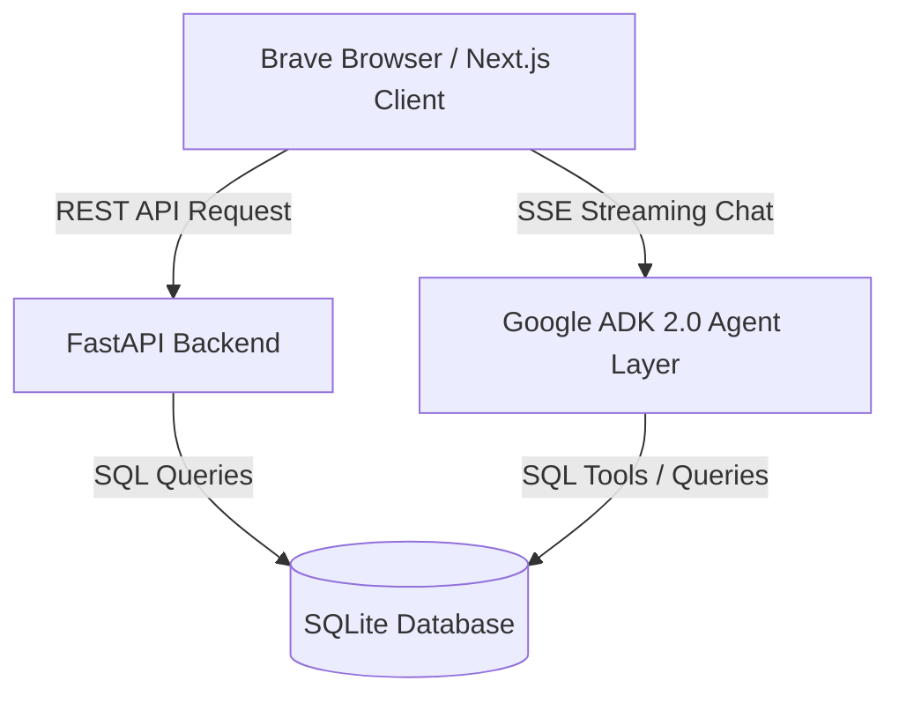
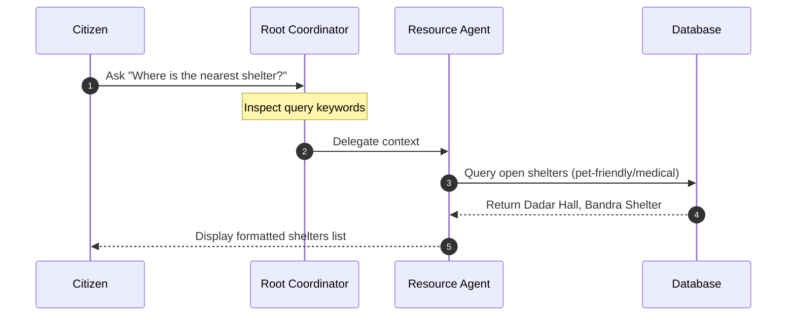
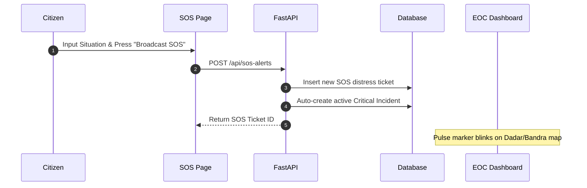

# ResQu AI – Emergency Response & Disaster Assistance Platform

ResQu AI is an advanced, AI-powered emergency response assistant and real-time situational awareness dashboard designed for citizens, volunteers, medical networks, and Emergency Operations Command (EOC) centers. It is built under the **"Agents for Good"** track to assist during critical regional disasters, localized for **Mumbai, India**.

---

## 🚀 Key Features

1. **AI Emergency Assistant**: A chat assistant utilizing a multi-agent routing structure (Google ADK 2.0) that classifies emergencies and delegates tasks to specialized sub-agents.
2. **EOC Dashboard**: Real-time situational command center with live counts of active emergencies, open shelter beds, open hospital beds, pending SOS alarms, and live stream logs.
3. **Interactive Maps (Leaflet)**: Pulse-marked coordinate mapping tracking active flood zones, fires, landslides, shelters, and hospitals.
4. **Evacuation Route Planner**: Generates safe routes between origin and destination coordinates, dynamically re-routing to bypass active hazard polygons.
5. **Medical Help Directory**: Displays nearby hospitals (KEM, Lilavati, Sion) with live bed counts, blood bank inventory, and quick-dial ambulance links.
6. **SOS Distress System**: Immediate broadcast of critical SOS tickets with mock GPS tracking to BMC/EOC dispatch teams.
7. **Missing Persons Board**: Searchable log of reported missing individuals with status tracking (missing, found, reunified).
8. **Volunteer Center**: Crisis responder deployment matching skills (CPR, Search & Rescue) with active EOC emergency tasks.
9. **Offline Emergency Mode**: Local-first survival guides (CPR, Earthquake protocols, Flood/Fire guidelines) printable to PDF for physical use.

---

## ⚙️ System Architecture



### Specialized Agents Layer
- **Root Coordinator Agent**: Orchestrates query analysis and delegates conversation contexts.
- **Resource Agent**: Queries database to locate open shelters, food centers, and distribution networks.
- **Routing Agent**: Evaluates road safety, blocked ways, and coordinates safe paths.
- **Medical Agent**: Accesses hospital bed capacity, blood banks, and guides basic first aid / CPR.
- **Communication Agent**: Dispatches SOS distress alerts to responder dispatch pipelines.
- **Preparedness Agent**: Generates tailored preparedness plans and supply checklists.

---

## 🔄 User Workflows

### 1. Emergency Assistance & Delegation Flow


### 2. SOS Alert Broadcast Flow


---

## 🛠️ Local Installation & Setup

### Prerequisites
- Node.js (v18+)
- Python (v3.10+)
- [uv](https://github.com/astral-sh/uv) (recommended) or pip

### Backend Setup (FastAPI)
1. Navigate to the backend directory:
   ```bash
   cd backend
   ```
2. Initialize virtual environment and install dependencies:
   ```bash
   uv venv
   source .venv/bin/activate
   uv pip install -r pyproject.toml
   ```
3. Initialize and seed the database with Indian/Mumbai data:
   ```bash
   uv run python -m app.seed
   ```
4. Start the FastAPI development server:
   ```bash
   uv run python -m uvicorn app.fast_api_app:app --port 8000 --log-level info
   ```

### Frontend Setup (Next.js)
1. Navigate to the frontend directory:
   ```bash
   cd ../frontend
   ```
2. Install dependencies:
   ```bash
   npm install
   ```
3. Run the Next.js development server:
   ```bash
   npm run dev -- -p 3000
   ```

Open [http://localhost:3000](http://localhost:3000) in **Brave Browser** to access the live dashboard.
